# Design Document

## Overview

The Computer-Based Test (CBT) Application is designed as a hybrid MERN stack application with both online and local server components. The architecture ensures secure test administration while providing flexible management capabilities. The system supports multimedia questions with rich text editing and Excel-based bulk uploads.

### Key Design Principles

- **Hybrid Architecture**: Online components for management, local components for secure test delivery
- **Data Synchronization**: Seamless sync between online and local databases
- **Multimedia Optimization**: Local storage of media files with size optimization
- **Security First**: Secure test environment with anti-cheating measures
- **User Experience**: Intuitive interfaces for all user roles
- **Leverage Existing Solutions**: Use proven libraries and tools instead of building from scratch

### Extensibility & Maintainability Principles

- **Domain-Driven Design (DDD)**: Clear domain boundaries and ubiquitous language
- **SOLID Principles**: Single responsibility, open/closed, dependency inversion
- **Clean Architecture**: Dependency inversion with clear layers (Domain, Application, Infrastructure)
- **Event-Driven Architecture**: Loose coupling through domain events and message queues
- **Plugin Architecture**: Extensible system for new question types, integrations, and features
- **API-First Design**: Well-defined contracts enabling easy integration and testing
- **Configuration-Driven**: Feature flags and configuration for easy customization
- **Observability**: Comprehensive logging, metrics, and tracing for maintainability

### Extensibility & Maintainability Principles

- **Domain-Driven Design (DDD)**: Clear domain boundaries and ubiquitous language
- **SOLID Principles**: Single responsibility, open/closed, dependency inversion
- **Clean Architecture**: Dependency inversion with clear layers (Domain, Application, Infrastructure)
- **Event-Driven Architecture**: Loose coupling through domain events and message queues
- **Plugin Architecture**: Extensible system for new question types, integrations, and features
- **API-First Design**: Well-defined contracts enabling easy integration and testing
- **Configuration-Driven**: Feature flags and configuration for easy customization
- **Observability**: Comprehensive logging, metrics, and tracing for maintainability

## Architectural Patterns & Best Practices

### Domain-Driven Design Structure

```
src/
├── domains/                    # Domain layer (business logic)
│   ├── auth/
│   │   ├── entities/          # Domain entities
│   │   ├── value-objects/     # Value objects
│   │   ├── repositories/      # Repository interfaces
│   │   ├── services/          # Domain services
│   │   └── events/            # Domain events
│   ├── testing/
│   │   ├── entities/          # Test, Question, Subject entities
│   │   ├── value-objects/     # Score, Duration, etc.
│   │   ├── repositories/      # Test, Question repositories
│   │   ├── services/          # Test creation, grading services
│   │   └── events/            # Test events
│   └── subscription/
├── application/               # Application layer (use cases)
│   ├── commands/             # Command handlers (CQRS)
│   ├── queries/              # Query handlers (CQRS)
│   ├── services/             # Application services
│   └── dto/                  # Data transfer objects
├── infrastructure/           # Infrastructure layer
│   ├── database/            # Database implementations
│   ├── external/            # External service integrations
│   ├── messaging/           # Event bus, message queues
│   └── storage/             # File storage implementations
└── presentation/            # Presentation layer
    ├── api/                 # REST API controllers
    ├── graphql/             # GraphQL resolvers (future)
    └── web/                 # React frontend
```

### Event-Driven Architecture

```javascript
// Domain Events for loose coupling
class TestCreatedEvent extends DomainEvent {
  constructor(testId, centerId, creatorId) {
    super("test.created", { testId, centerId, creatorId });
  }
}

// Event handlers for cross-domain concerns
class TestCreatedHandler {
  async handle(event) {
    // Update subscription usage
    await this.subscriptionService.incrementTestCount(event.centerId);

    // Send notification
    await this.notificationService.notifyTestCreated(event);

    // Update analytics
    await this.analyticsService.recordTestCreation(event);
  }
}
```

### Plugin Architecture for Extensibility

```javascript
// Question type plugin interface
interface QuestionTypePlugin {
  type: string;
  validate(questionData: any): ValidationResult;
  render(question: Question): React.Component;
  grade(question: Question, answer: any): GradingResult;
}

// Plugin registry for easy extension
class QuestionTypeRegistry {
  private plugins = new Map<string, QuestionTypePlugin>();

  register(plugin: QuestionTypePlugin) {
    this.plugins.set(plugin.type, plugin);
  }

  getPlugin(type: string): QuestionTypePlugin {
    return this.plugins.get(type);
  }
}

// Easy to add new question types
const essayQuestionPlugin: QuestionTypePlugin = {
  type: 'essay',
  validate: (data) => validateEssayQuestion(data),
  render: (question) => <EssayQuestionComponent question={question} />,
  grade: (question, answer) => gradeEssayAnswer(question, answer)
};
```

## Architectural Patterns & Best Practices

### Domain-Driven Design Structure

```
src/
├── domains/                    # Domain layer (business logic)
│   ├── auth/
│   │   ├── entities/          # Domain entities
│   │   ├── value-objects/     # Value objects
│   │   ├── repositories/      # Repository interfaces
│   │   ├── services/          # Domain services
│   │   └── events/            # Domain events
│   ├── testing/
│   │   ├── entities/          # Test, Question, Subject entities
│   │   ├── value-objects/     # Score, Duration, etc.
│   │   ├── repositories/      # Test, Question repositories
│   │   ├── services/          # Test creation, grading services
│   │   └── events/            # Test events
│   └── subscription/
├── application/               # Application layer (use cases)
│   ├── commands/             # Command handlers (CQRS)
│   ├── queries/              # Query handlers (CQRS)
│   ├── services/             # Application services
│   └── dto/                  # Data transfer objects
├── infrastructure/           # Infrastructure layer
│   ├── database/            # Database implementations
│   ├── external/            # External service integrations
│   ├── messaging/           # Event bus, message queues
│   └── storage/             # File storage implementations
└── presentation/            # Presentation layer
    ├── api/                 # REST API controllers
    ├── graphql/             # GraphQL resolvers (future)
    └── web/                 # React frontend
```

### Event-Driven Architecture

```javascript
// Domain Events for loose coupling
class TestCreatedEvent extends DomainEvent {
  constructor(testId, centerId, creatorId) {
    super("test.created", { testId, centerId, creatorId });
  }
}

// Event handlers for cross-domain concerns
class TestCreatedHandler {
  async handle(event) {
    // Update subscription usage
    await this.subscriptionService.incrementTestCount(event.centerId);

    // Send notification
    await this.notificationService.notifyTestCreated(event);

    // Update analytics
    await this.analyticsService.recordTestCreation(event);
  }
}
```

### Plugin Architecture for Extensibility

```javascript
// Question type plugin interface
interface QuestionTypePlugin {
  type: string;
  validate(questionData: any): ValidationResult;
  render(question: Question): React.Component;
  grade(question: Question, answer: any): GradingResult;
}

// Plugin registry for easy extension
class QuestionTypeRegistry {
  private plugins = new Map<string, QuestionTypePlugin>();

  register(plugin: QuestionTypePlugin) {
    this.plugins.set(plugin.type, plugin);
  }

  getPlugin(type: string): QuestionTypePlugin {
    return this.plugins.get(type);
  }
}

// Example plugin implementation
class MultipleChoicePlugin implements QuestionTypePlugin {
  type = "multiple-choice";

  validate(questionData: any): ValidationResult {
    // Validation logic
  }

  render(question: Question): React.Component {
    return <MultipleChoiceQuestion question={question} />;
  }

  grade(question: Question, answer: any): GradingResult {
    // Grading logic
  }
}
```

### CQRS Pattern Implementation

```javascript
// Command side (writes)
class CreateTestCommand {
  constructor(
    public readonly testData: CreateTestData,
    public readonly centerId: string,
    public readonly creatorId: string
  ) {}
}

class CreateTestHandler {
  async handle(command: CreateTestCommand): Promise<TestId> {
    // Validate subscription limits
    await this.subscriptionService.validateTestCreation(command.centerId);

    // Create test entity
    const test = Test.create(command.testData, command.centerId, command.creatorId);

    // Save to repository
    await this.testRepository.save(test);

    // Publish domain event
    await this.eventBus.publish(new TestCreatedEvent(test.id, command.centerId, command.creatorId));

    return test.id;
  }
}

// Query side (reads)
class GetTestQuery {
  constructor(public readonly testId: string) {}
}

class GetTestHandler {
  async handle(query: GetTestQuery): Promise<TestDto> {
    const test = await this.testReadModel.findById(query.testId);
    return TestDto.fromEntity(test);
  }
}
```

### Repository Pattern with Clean Interfaces

```javascript
// Domain repository interface (in domain layer)
interface TestRepository {
  save(test: Test): Promise<void>;
  findById(id: TestId): Promise<Test>;
  findByCenter(centerId: string): Promise<Test[]>;
  delete(id: TestId): Promise<void>;
}

// Infrastructure implementation (in infrastructure layer)
class MongoTestRepository implements TestRepository {
  constructor(private db: MongoDatabase) {}

  async save(test: Test): Promise<void> {
    const document = TestMapper.toDocument(test);
    await this.db.collection('tests').replaceOne(
      { _id: test.id.value },
      document,
      { upsert: true }
    );
  }

  async findById(id: TestId): Promise<Test> {
    const document = await this.db.collection('tests').findOne({ _id: id.value });
    return TestMapper.toEntity(document);
  }
}
```

### Configuration-Driven Architecture

```javascript
// Feature flags for easy extension
interface FeatureFlags {
  calculatorEnabled: boolean;
  aiProctoringEnabled: boolean;
  adaptiveTestingEnabled: boolean;
  blockchainCertificatesEnabled: boolean;
}

// Configuration service
class ConfigurationService {
  constructor(private config: ApplicationConfig) {}

  getFeatureFlags(centerId: string): FeatureFlags {
    return {
      calculatorEnabled: this.config.features.calculator.enabled,
      aiProctoringEnabled: this.config.features.aiProctoring.enabled &&
                          this.hasSubscription(centerId, 'premium'),
      adaptiveTestingEnabled: this.config.features.adaptiveTesting.enabled,
      blockchainCertificatesEnabled: this.config.features.blockchain.enabled
    };
  }
}
```

## Architecture

### High-Level Architecture

```mermaid
graph TB
    subgraph "Online Cloud Infrastructure"
        LB[Load Balancer - NGINX]
        AG[API Gateway]

        subgraph "Microservices"
            AUTH[Auth Service]
            USER[User Service]
            TEST[Test Service + Media Storage]
            MEDIA_PROC[Media Processing Service]
            SUBSCRIPTION[Subscription Service]
            SYNC[Sync Service]
            ANALYTICS[Analytics Service]
        end

        OW[Online Web App - React]
        REDIS[(Redis Cache)]
        ODB[(MongoDB Atlas)]
        CDN[CDN - Static Assets]
    end

    subgraph "Local Server Infrastructure"
        subgraph "Local Services"
            L_AUTH[Local Auth Service]
            L_TEST[Local Test Service + Media Storage]
            L_MEDIA_PROC[Local Media Processing Service]
            L_SYNC[Local Sync Service]
        end

        LW[Local Web App - React]
        L_REDIS[(Local Redis)]
        LDB[(Local MongoDB)]
        FS[File System - Media Storage]
    end

    subgraph "Client Devices"
        TC[Test Center Admin]
        ST[Students]
    end

    subgraph "Monitoring & DevOps"
        PROM[Prometheus]
        GRAF[Grafana]
        ELK[ELK Stack]
    end

    LB --> AG
    AG --> AUTH
    AG --> USER
    AG --> TEST
    AG --> SUBSCRIPTION
    AG --> SYNC
    AG --> ANALYTICS

    TEST --> MEDIA_PROC
    TEST --> SUBSCRIPTION

    OW --> LB
    AUTH --> REDIS
    USER --> ODB
    TEST --> ODB
    TEST --> CDN
    SUBSCRIPTION --> ODB
    SYNC --> ODB
    ANALYTICS --> ODB

    LW --> L_AUTH
    LW --> L_TEST
    L_AUTH --> L_REDIS
    L_TEST --> LDB
    L_TEST --> FS
    L_TEST --> L_MEDIA_PROC
    L_MEDIA_PROC --> FS
    L_SYNC --> LDB

    TC --> OW
    TC --> LW
    ST --> LW

    SYNC <--> L_SYNC
    ODB <--> LDB

    AUTH --> PROM
    TEST --> PROM
    PROM --> GRAF
    AUTH --> ELK
    TEST --> ELK
```



### Technology Stack

**Frontend (React)**

- React 18+ with functional components and hooks
- React Router for navigation
- **Tailwind CSS** for utility-first styling and responsive design
- **React Context API** for state management (Auth, Test, Theme contexts)
- Rich text editor: React-Quill or Draft.js with Tailwind styling
- File upload: React-Dropzone with custom Tailwind components
- Headless UI components for accessibility (works well with Tailwind)
- React Hook Form for form management and validation
- Docker containerization for consistent deployment

**Backend Microservices (Node.js/Express)**

- **API Gateway**: Express.js with rate limiting and request routing
- **Authentication Service**: JWT with refresh tokens, OAuth integration
- **Test Management Service**: Test CRUD operations, media storage/serving, and validation
- **Media Processing Service**: Background processing for image/audio optimization and format conversion
- **User Management Service**: User registration, roles, and permissions
- **Subscription Service**: Tier management, payment processing, and usage tracking
- **Sync Service**: Data synchronization between online and local systems
- **Analytics Service**: Test results processing and reporting

**Caching & Performance**

- **Redis**: Session storage, caching, and real-time data
- **CDN**: Static asset delivery (images, audio files)
- **Load Balancer**: NGINX for traffic distribution
- **Message Queue**: Redis Bull for background job processing

**Database Layer**

- **MongoDB**: Primary database for both online and local instances
- **Mongoose ODM**: Data modeling and validation
- **MongoDB Atlas**: Cloud database for online components
- **Local MongoDB**: Containerized instance for local servers

**DevOps & Infrastructure**

- **Docker & Docker Compose**: Containerization and orchestration
- **CI/CD Pipeline**: GitHub Actions or GitLab CI (free tiers available)
- **Monitoring Options**:
  - **Free**: Prometheus + Grafana (completely open source)
- **Logging Options**:
  - **Free**: ELK Stack (Elasticsearch, Logstash, Kibana) - open source
  - **Alternative Free**: Loki + Grafana, or simple file-based logging
- **Health Checks**: Custom health endpoints for all services

**Additional Tools**

- Excel processing: SheetJS (xlsx)
- File compression: Sharp, FFmpeg
- Encryption: bcrypt, crypto
- Validation: Joi or Yup
- **Calculator Engine**: Math.js (powerful expression evaluator)
- API Documentation: Swagger/OpenAPI
- Environment Management: dotenv, config

### Cost-Effective Monitoring Strategy

**Free Monitoring Stack (Recommended for Development/Small Scale)**

```yaml
# docker-compose.monitoring.yml
version: "3.8"
services:
  prometheus:
    image: prom/prometheus:latest
    ports: ["9090:9090"]
    volumes: ["./prometheus.yml:/etc/prometheus/prometheus.yml"]

  grafana:
    image: grafana/grafana:latest
    ports: ["3001:3000"]
    environment:
      - GF_SECURITY_ADMIN_PASSWORD=admin
    volumes: ["grafana-storage:/var/lib/grafana"]

  # Simple logging with Loki (lighter than ELK)
  loki:
    image: grafana/loki:latest
    ports: ["3100:3100"]

  promtail:
    image: grafana/promtail:latest
    volumes:
      - /var/log:/var/log
      - ./promtail-config.yml:/etc/promtail/config.yml
```

**Monitoring Costs Breakdown:**

- **Prometheus + Grafana**: 100% free, open source
- **ELK Stack**: Free open source, but resource-intensive
- **Loki + Grafana**: Lightweight, free alternative to ELK
- **Simple File Logging**: Zero cost, basic but effective for small scale

**Production Monitoring Options:**

- **Self-hosted (Free)**: Prometheus + Grafana + Loki

### Containerization Strategy

**Docker Architecture**

```yaml
# docker-compose.yml structure
version: "3.8"
services:
  # Frontend
  web-app:
    build: ./frontend
    ports: ["3000:3000"]
    environment:
      - REACT_APP_API_URL=http://api-gateway:4000

  # API Gateway
  api-gateway:
    build: ./api-gateway
    ports: ["4000:4000"]
    depends_on: [redis, auth-service, test-service]

  # Microservices
  auth-service:
    build: ./services/auth
    environment:
      - REDIS_URL=redis://redis:6379
      - MONGODB_URL=mongodb://mongo:27017/cbt_auth

  test-service:
    build: ./services/test
    environment:
      - MONGODB_URL=mongodb://mongo:27017/cbt_tests
      - REDIS_URL=redis://redis:6379
      - MEDIA_PROCESSING_URL=http://media-processing:5000
    volumes: ["./media:/app/uploads"]

  media-processing:
    build: ./services/media-processing
    environment:
      - REDIS_URL=redis://redis:6379
    volumes: ["./media:/app/media"]

  subscription-service:
    build: ./services/subscription
    environment:
      - MONGODB_URL=mongodb://mongo:27017/cbt_subscriptions
      - REDIS_URL=redis://redis:6379
      - STRIPE_SECRET_KEY=${STRIPE_SECRET_KEY}
      - PAYPAL_CLIENT_ID=${PAYPAL_CLIENT_ID}

  # Infrastructure
  redis:
    image: redis:7-alpine
    ports: ["6379:6379"]

  mongo:
    image: mongo:6
    ports: ["27017:27017"]
    volumes: ["mongo_data:/data/db"]

  nginx:
    image: nginx:alpine
    ports: ["80:80"]
    volumes: ["./nginx.conf:/etc/nginx/nginx.conf"]
```

**Development vs Production Containers**

- **Development**: Hot reload, debug ports, volume mounts
- **Production**: Optimized builds, health checks, resource limits
- **Local Server**: Lightweight containers for offline operation

## Components and Interfaces

### Frontend Architecture

**React Context Structure**

```javascript
// Authentication Context
const AuthContext = createContext();
export const AuthProvider = ({ children }) => {
  const [user, setUser] = useState(null);
  const [loading, setLoading] = useState(true);
  const [token, setToken] = useState(localStorage.getItem("token"));

  const login = async (credentials) => {
    const response = await authService.login(credentials);
    setUser(response.user);
    setToken(response.token);
    localStorage.setItem("token", response.token);
  };

  const logout = () => {
    setUser(null);
    setToken(null);
    localStorage.removeItem("token");
  };

  return (
    <AuthContext.Provider value={{ user, login, logout, loading, token }}>
      {children}
    </AuthContext.Provider>
  );
};

// Test Context for test-taking functionality
const TestContext = createContext();
export const TestProvider = ({ children }) => {
  const [currentTest, setCurrentTest] = useState(null);
  const [answers, setAnswers] = useState({});
  const [timeRemaining, setTimeRemaining] = useState(0);
  const [isSubmitted, setIsSubmitted] = useState(false);

  const saveAnswer = (questionId, answer) => {
    setAnswers((prev) => ({ ...prev, [questionId]: answer }));
  };

  const submitTest = async () => {
    await testService.submitAnswers(currentTest.id, answers);
    setIsSubmitted(true);
  };

  return (
    <TestContext.Provider
      value={{
        currentTest,
        setCurrentTest,
        answers,
        saveAnswer,
        timeRemaining,
        setTimeRemaining,
        submitTest,
        isSubmitted,
      }}
    >
      {children}
    </TestContext.Provider>
  );
};

// Theme Context for UI customization
const ThemeContext = createContext();
export const ThemeProvider = ({ children }) => {
  const [theme, setTheme] = useState("light");
  const [fontSize, setFontSize] = useState("base");

  const toggleTheme = () => {
    setTheme((prev) => (prev === "light" ? "dark" : "light"));
  };

  return (
    <ThemeContext.Provider
      value={{ theme, toggleTheme, fontSize, setFontSize }}
    >
      {children}
    </ThemeContext.Provider>
  );
};
```

**Tailwind CSS Configuration**

```javascript
// tailwind.config.js
module.exports = {
  content: ["./src/**/*.{js,jsx,ts,tsx}"],
  darkMode: "class",
  theme: {
    extend: {
      colors: {
        primary: {
          50: "#eff6ff",
          500: "#3b82f6",
          600: "#2563eb",
          700: "#1d4ed8",
        },
        secondary: {
          50: "#f8fafc",
          500: "#64748b",
          600: "#475569",
        },
      },
      fontFamily: {
        sans: ["Inter", "system-ui", "sans-serif"],
      },
      animation: {
        "fade-in": "fadeIn 0.5s ease-in-out",
        "slide-up": "slideUp 0.3s ease-out",
      },
    },
  },
  plugins: [
    require("@tailwindcss/forms"),
    require("@tailwindcss/typography"),
    require("@headlessui/tailwindcss"),
  ],
};
```

**Component Structure with Tailwind**

```javascript
// Example: Test Question Component with Calculator Tool
const QuestionCard = ({ question, onAnswer, selectedAnswer }) => {
  return (
    <div className="bg-white dark:bg-gray-800 rounded-lg shadow-md p-6 mb-6">
      <div className="mb-4">
        <h3 className="text-lg font-semibold text-gray-900 dark:text-white mb-2">
          Question {question.order}
        </h3>
        <div
          className="prose dark:prose-invert max-w-none"
          dangerouslySetInnerHTML={{ __html: question.content.text }}
        />
      </div>

      {question.content.media.map((media) => (
        <div key={media.id} className="mb-4">
          {media.type === "image" && (
            
          )}
          {media.type === "audio" && (
            <audio controls className="w-full" src={media.url} />
          )}
        </div>
      ))}

      <div className="space-y-2">
        {question.answers.map((answer) => (
          <label
            key={answer._id}
            className="flex items-center p-3 border border-gray-200 dark:border-gray-600 rounded-md hover:bg-gray-50 dark:hover:bg-gray-700 cursor-pointer transition-colors"
          >
            <input
              type={question.type === "single" ? "radio" : "checkbox"}
              name={`question-${question._id}`}
              value={answer._id}
              checked={selectedAnswer?.includes(answer._id)}
              onChange={() => onAnswer(question._id, answer._id)}
              className="mr-3 text-primary-600 focus:ring-primary-500"
            />
            <span className="text-gray-900 dark:text-white">{answer.text}</span>
          </label>
        ))}
      </div>
    </div>
  );
};

// Calculator Tool Component using Math.js (existing solution)
import { evaluate } from "mathjs";

const Calculator = ({ isOpen, onToggle }) => {
  const [expression, setExpression] = useState("");
  const [result, setResult] = useState("0");

  const handleCalculate = () => {
    try {
      const calculatedResult = evaluate(expression);
      setResult(calculatedResult.toString());
    } catch (error) {
      setResult("Error");
    }
  };

  const handleInput = (value) => {
    setExpression((prev) => prev + value);
  };

  const handleClear = () => {
    setExpression("");
    setResult("0");
  };

  if (!isOpen) return null;

  return (
    <div className="fixed bottom-4 right-4 bg-white dark:bg-gray-800 rounded-lg shadow-lg p-4 z-50 w-64">
      <div className="flex justify-between items-center mb-4">
        <h3 className="text-lg font-semibold">Calculator</h3>
        <button
          onClick={onToggle}
          className="text-gray-500 hover:text-gray-700 text-xl"
        >
          ×
        </button>
      </div>

      {/* Expression Input - allows typing complex expressions */}
      <input
        type="text"
        value={expression}
        onChange={(e) => setExpression(e.target.value)}
        className="w-full p-2 mb-2 border rounded text-right font-mono text-sm"
        placeholder="Enter expression... (e.g., 2+3*4)"
      />

      {/* Result Display */}
      <div className="bg-gray-100 dark:bg-gray-700 p-3 rounded mb-3 text-right text-xl font-mono">
        {result}
      </div>

      {/* Calculator Buttons */}
      <div className="grid grid-cols-4 gap-1 text-sm">
        <button
          onClick={handleClear}
          className="bg-red-500 hover:bg-red-600 text-white p-2 rounded col-span-2"
        >
          Clear
        </button>
        <button
          onClick={() => handleInput("(")}
          className="bg-gray-200 hover:bg-gray-300 p-2 rounded"
        >
          (
        </button>
        <button
          onClick={() => handleInput(")")}
          className="bg-gray-200 hover:bg-gray-300 p-2 rounded"
        >
          )
        </button>

        <button
          onClick={() => handleInput("7")}
          className="bg-gray-100 hover:bg-gray-200 p-2 rounded"
        >
          7
        </button>
        <button
          onClick={() => handleInput("8")}
          className="bg-gray-100 hover:bg-gray-200 p-2 rounded"
        >
          8
        </button>
        <button
          onClick={() => handleInput("9")}
          className="bg-gray-100 hover:bg-gray-200 p-2 rounded"
        >
          9
        </button>
        <button
          onClick={() => handleInput("/")}
          className="bg-orange-500 hover:bg-orange-600 text-white p-2 rounded"
        >
          ÷
        </button>

        <button
          onClick={() => handleInput("4")}
          className="bg-gray-100 hover:bg-gray-200 p-2 rounded"
        >
          4
        </button>
        <button
          onClick={() => handleInput("5")}
          className="bg-gray-100 hover:bg-gray-200 p-2 rounded"
        >
          5
        </button>
        <button
          onClick={() => handleInput("6")}
          className="bg-gray-100 hover:bg-gray-200 p-2 rounded"
        >
          6
        </button>
        <button
          onClick={() => handleInput("*")}
          className="bg-orange-500 hover:bg-orange-600 text-white p-2 rounded"
        >
          ×
        </button>

        <button
          onClick={() => handleInput("1")}
          className="bg-gray-100 hover:bg-gray-200 p-2 rounded"
        >
          1
        </button>
        <button
          onClick={() => handleInput("2")}
          className="bg-gray-100 hover:bg-gray-200 p-2 rounded"
        >
          2
        </button>
        <button
          onClick={() => handleInput("3")}
          className="bg-gray-100 hover:bg-gray-200 p-2 rounded"
        >
          3
        </button>
        <button
          onClick={() => handleInput("-")}
          className="bg-orange-500 hover:bg-orange-600 text-white p-2 rounded"
        >
          −
        </button>

        <button
          onClick={() => handleInput("0")}
          className="bg-gray-100 hover:bg-gray-200 p-2 rounded col-span-2"
        >
          0
        </button>
        <button
          onClick={() => handleInput(".")}
          className="bg-gray-100 hover:bg-gray-200 p-2 rounded"
        >
          .
        </button>
        <button
          onClick={() => handleInput("+")}
          className="bg-orange-500 hover:bg-orange-600 text-white p-2 rounded"
        >
          +
        </button>

        <button
          onClick={handleCalculate}
          className="bg-blue-500 hover:bg-blue-600 text-white p-2 rounded col-span-4"
        >
          =
        </button>
      </div>
    </div>
  );
};

// Test Interface with Calculator
const TestInterface = ({ test, calculatorEnabled }) => {
  const [calculatorOpen, setCalculatorOpen] = useState(false);

  return (
    <div className="test-interface">
      {/* Test content */}

      {calculatorEnabled && (
        <>
          <button
            onClick={() => setCalculatorOpen(!calculatorOpen)}
            className="fixed bottom-4 right-4 bg-blue-500 hover:bg-blue-600 text-white p-3 rounded-full shadow-lg"
          >
            🧮
          </button>
          <Calculator
            isOpen={calculatorOpen}
            onToggle={() => setCalculatorOpen(!calculatorOpen)}
          />
        </>
      )}
    </div>
  );
};
```

## Clean Architecture Implementation

### Layered Architecture Pattern

```
┌─────────────────────────────────────────────────────────────┐
│                    Presentation Layer                       │
│  ┌─────────────────┐  ┌─────────────────┐  ┌─────────────┐ │
│  │   REST API      │  │    GraphQL      │  │  React UI   │ │
│  │  Controllers    │  │   Resolvers     │  │ Components  │ │
│  └─────────────────┘  └─────────────────┘  └─────────────┘ │
└─────────────────────────────────────────────────────────────┘
                              │
┌─────────────────────────────────────────────────────────────┐
│                   Application Layer                         │
│  ┌─────────────────┐  ┌─────────────────┐  ┌─────────────┐ │
│  │   Use Cases     │  │   Commands      │  │   Queries   │ │
│  │   (Services)    │  │   (CQRS)        │  │   (CQRS)    │ │
│  └─────────────────┘  └─────────────────┘  └─────────────┘ │
└─────────────────────────────────────────────────────────────┘
                              │
┌─────────────────────────────────────────────────────────────┐
│                     Domain Layer                            │
│  ┌─────────────────┐  ┌─────────────────┐  ┌─────────────┐ │
│  │    Entities     │  │  Value Objects  │  │   Events    │ │
│  │   (Aggregates)  │  │   (Immutable)   │  │ (Domain)    │ │
│  └─────────────────┘  └─────────────────┘  └─────────────┘ │
└─────────────────────────────────────────────────────────────┘
                              │
┌─────────────────────────────────────────────────────────────┐
│                 Infrastructure Layer                        │
│  ┌─────────────────┐  ┌─────────────────┐  ┌─────────────┐ │
│  │   Database      │  │   External      │  │   Message   │ │
│  │ Repositories    │  │   Services      │  │    Queue    │ │
│  └─────────────────┘  └─────────────────┘  └─────────────┘ │
└─────────────────────────────────────────────────────────────┘
```

### Domain-Driven Design Implementation

```javascript
// Domain Entity - Rich business logic
class Test {
  constructor(
    private id: TestId,
    private title: TestTitle,
    private centerId: CenterId,
    private questions: Question[],
    private settings: TestSettings,
    private status: TestStatus
  ) {}

  // Business logic methods
  addQuestion(question: Question): void {
    if (this.status === TestStatus.PUBLISHED) {
      throw new DomainError('Cannot modify published test');
    }

    if (this.questions.length >= this.settings.maxQuestions) {
      throw new DomainError('Maximum questions limit reached');
    }

    this.questions.push(question);
    this.addDomainEvent(new QuestionAddedEvent(this.id, question.id));
  }

  publish(): void {
    if (this.questions.length === 0) {
      throw new DomainError('Cannot publish test without questions');
    }

    this.status = TestStatus.PUBLISHED;
    this.addDomainEvent(new TestPublishedEvent(this.id, this.centerId));
  }

  calculateDuration(): Duration {
    return this.questions.reduce(
      (total, question) => total.add(question.estimatedTime),
      Duration.zero()
    );
  }
}

// Value Objects - Immutable and self-validating
class TestTitle {
  constructor(private value: string) {
    if (!value || value.trim().length < 3) {
      throw new ValidationError('Test title must be at least 3 characters');
    }
    if (value.length > 100) {
      throw new ValidationError('Test title cannot exceed 100 characters');
    }
    this.value = value.trim();
  }

  toString(): string {
    return this.value;
  }

  equals(other: TestTitle): boolean {
    return this.value === other.value;
  }
}

// Repository Interface - Domain layer defines contract
interface TestRepository {
  save(test: Test): Promise<void>;
  findById(id: TestId): Promise<Test | null>;
  findByCenter(centerId: CenterId, filters?: TestFilters): Promise<Test[]>;
  delete(id: TestId): Promise<void>;
  nextId(): TestId;
}

// Application Service - Orchestrates use cases
class CreateTestUseCase {
  constructor(
    private testRepository: TestRepository,
    private subscriptionService: SubscriptionService,
    private eventBus: EventBus
  ) {}

  async execute(command: CreateTestCommand): Promise<TestCreatedResult> {
    // Validate subscription limits
    const canCreate = await this.subscriptionService.canCreateTest(command.centerId);
    if (!canCreate) {
      throw new BusinessRuleViolationError('Test creation limit exceeded');
    }

    // Create domain entity
    const test = Test.create(
      this.testRepository.nextId(),
      new TestTitle(command.title),
      command.centerId,
      TestSettings.fromCommand(command)
    );

    // Save to repository
    await this.testRepository.save(test);

    // Publish domain events
    await this.eventBus.publishAll(test.domainEvents);

    return new TestCreatedResult(test.id, test.title.toString());
  }
}
```

### CQRS Pattern Implementation

```javascript
// Command Side - Write operations
interface Command {
  readonly type: string;
  readonly aggregateId: string;
  readonly timestamp: Date;
}

class CreateTestCommand implements Command {
  readonly type = 'CREATE_TEST';

  constructor(
    readonly aggregateId: string,
    readonly title: string,
    readonly centerId: string,
    readonly settings: TestSettingsDto,
    readonly timestamp: Date = new Date()
  ) {}
}

// Query Side - Read operations
interface Query<TResult> {
  readonly type: string;
}

class GetTestsByCenterQuery implements Query<TestDto[]> {
  readonly type = 'GET_TESTS_BY_CENTER';

  constructor(
    readonly centerId: string,
    readonly filters?: TestFilters,
    readonly pagination?: PaginationOptions
  ) {}
}

// Separate read models for optimal queries
interface TestReadModel {
  id: string;
  title: string;
  centerId: string;
  questionCount: number;
  status: string;
  createdAt: Date;
  lastModified: Date;
}

// Query handler with optimized read model
class GetTestsByCenterQueryHandler {
  constructor(private readModelRepository: TestReadModelRepository) {}

  async handle(query: GetTestsByCenterQuery): Promise<TestDto[]> {
    const readModels = await this.readModelRepository.findByCenter(
      query.centerId,
      query.filters,
      query.pagination
    );

    return readModels.map(rm => TestDto.fromReadModel(rm));
  }
}
```

### Event-Driven Architecture

```javascript
// Domain Events for loose coupling
abstract class DomainEvent {
  readonly occurredOn: Date = new Date();
  readonly eventId: string = uuid();

  constructor(
    readonly eventType: string,
    readonly aggregateId: string,
    readonly payload: any
  ) {}
}

class TestCreatedEvent extends DomainEvent {
  constructor(testId: string, centerId: string, creatorId: string) {
    super('TEST_CREATED', testId, { centerId, creatorId });
  }
}

// Event Bus for decoupled communication
interface EventBus {
  publish(event: DomainEvent): Promise<void>;
  publishAll(events: DomainEvent[]): Promise<void>;
  subscribe<T extends DomainEvent>(
    eventType: string,
    handler: EventHandler<T>
  ): void;
}

// Event Handlers for cross-cutting concerns
class TestCreatedEventHandler implements EventHandler<TestCreatedEvent> {
  constructor(
    private subscriptionService: SubscriptionService,
    private notificationService: NotificationService,
    private analyticsService: AnalyticsService
  ) {}

  async handle(event: TestCreatedEvent): Promise<void> {
    // Each service handles its own concern independently
    await Promise.allSettled([
      this.subscriptionService.incrementTestCount(event.payload.centerId),
      this.notificationService.sendTestCreatedNotification(event),
      this.analyticsService.recordTestCreation(event)
    ]);
  }
}
```

### Plugin Architecture for Extensibility

```javascript
// Plugin interface for question types
interface QuestionTypePlugin {
  readonly type: string;
  readonly version: string;

  validate(data: unknown): ValidationResult;
  create(data: ValidatedQuestionData): Question;
  render(question: Question, mode: RenderMode): React.ComponentType;
  grade(question: Question, answer: StudentAnswer): GradingResult;
}

// Plugin registry with dependency injection
class PluginRegistry {
  private plugins = new Map<string, QuestionTypePlugin>();

  register(plugin: QuestionTypePlugin): void {
    this.plugins.set(plugin.type, plugin);
  }

  getPlugin(type: string): QuestionTypePlugin {
    const plugin = this.plugins.get(type);
    if (!plugin) {
      throw new PluginNotFoundError(`Question type plugin '${type}' not found`);
    }
    return plugin;
  }

  getAllPlugins(): QuestionTypePlugin[] {
    return Array.from(this.plugins.values());
  }
}

// Example plugin implementation
class MultipleChoicePlugin implements QuestionTypePlugin {
  readonly type = 'multiple-choice';
  readonly version = '1.0.0';

  validate(data: unknown): ValidationResult {
    const schema = Joi.object({
      text: Joi.string().required(),
      options: Joi.array().items(Joi.string()).min(2).required(),
      correctAnswers: Joi.array().items(Joi.number()).min(1).required()
    });

    return schema.validate(data);
  }

  create(data: ValidatedQuestionData): Question {
    return new MultipleChoiceQuestion(
      data.text,
      data.options,
      data.correctAnswers
    );
  }

  render(question: Question, mode: RenderMode): React.ComponentType {
    return mode === 'student'
      ? MultipleChoiceStudentView
      : MultipleChoiceCreatorView;
  }

  grade(question: Question, answer: StudentAnswer): GradingResult {
    const mcQuestion = question as MultipleChoiceQuestion;
    const selectedOptions = answer.selectedOptions || [];

    const correctCount = selectedOptions.filter(opt =>
      mcQuestion.correctAnswers.includes(opt)
    ).length;

    const incorrectCount = selectedOptions.length - correctCount;
    const missedCount = mcQuestion.correctAnswers.length - correctCount;

    // Partial credit calculation
    const score = Math.max(0,
      (correctCount - incorrectCount) / mcQuestion.correctAnswers.length
    );

    return new GradingResult(score, {
      correct: correctCount,
      incorrect: incorrectCount,
      missed: missedCount
    });
  }
}
```

### Configuration-Driven Development

```javascript
// Feature flags for gradual rollout
interface FeatureFlags {
  enableQuestionBank: boolean;
  enableAIProctoring: boolean;
  enableAdvancedAnalytics: boolean;
  maxQuestionsPerTest: number;
  supportedQuestionTypes: string[];
}

// Configuration service
class ConfigurationService {
  constructor(private configRepository: ConfigRepository) {}

  async getFeatureFlags(centerId: string): Promise<FeatureFlags> {
    const centerConfig = await this.configRepository.findByCenter(centerId);
    const globalConfig = await this.configRepository.getGlobal();

    // Merge configurations with center-specific overrides
    return {
      ...globalConfig.features,
      ...centerConfig?.features
    };
  }

  async isFeatureEnabled(centerId: string, feature: string): Promise<boolean> {
    const flags = await this.getFeatureFlags(centerId);
    return flags[feature] === true;
  }
}

// Usage in application services
class CreateTestUseCase {
  async execute(command: CreateTestCommand): Promise<TestCreatedResult> {
    // Check if question bank feature is enabled
    const questionBankEnabled = await this.configService.isFeatureEnabled(
      command.centerId,
      'enableQuestionBank'
    );

    if (command.useQuestionBank && !questionBankEnabled) {
      throw new FeatureNotEnabledError('Question bank feature not enabled');
    }

    // Continue with use case...
  }
}
```

### Clean Architecture Implementation

```
┌─────────────────────────────────────────────────────────────┐
│                   Presentation Layer                        │
│  ┌─────────────────┐  ┌─────────────────┐  ┌─────────────┐ │
│  │   REST API      │  │    GraphQL      │  │  React UI   │ │
│  │  Controllers    │  │   Resolvers     │  │ Components  │ │
│  └─────────────────┘  └─────────────────┘  └─────────────┘ │
└─────────────────────────────────────────────────────────────┘
                              │
┌─────────────────────────────────────────────────────────────┐
│                   Application Layer                         │
│  ┌─────────────────┐  ┌─────────────────┐  ┌─────────────┐ │
│  │   Use Cases     │  │   Commands      │  │   Queries   │ │
│  │   (Services)    │  │   (CQRS)        │  │   (CQRS)    │ │
│  └─────────────────┘  └─────────────────┘  └─────────────┘ │
└─────────────────────────────────────────────────────────────┘
                              │
┌─────────────────────────────────────────────────────────────┐
│                     Domain Layer                            │
│  ┌─────────────────┐  ┌─────────────────┐  ┌─────────────┐ │
│  │    Entities     │  │  Value Objects  │  │   Events    │ │
│  │   (Aggregates)  │  │   (Immutable)   │  │ (Domain)    │ │
│  └─────────────────┘  └─────────────────┘  └─────────────┘ │
└─────────────────────────────────────────────────────────────┘
                              │
┌─────────────────────────────────────────────────────────────┐
│                 Infrastructure Layer                        │
│  ┌─────────────────┐  ┌─────────────────┐  ┌─────────────┐ │
│  │   Database      │  │   External      │  │   Message   │ │
│  │ Repositories    │  │   Services      │  │    Queue    │ │
│  └─────────────────┘  └─────────────────┘  └─────────────┘ │
└─────────────────────────────────────────────────────────────┘
```

### Domain-Driven Design Implementation

```javascript
// Domain Entity - Rich business logic
class Test {
  constructor(
    private id: TestId,
    private title: TestTitle,
    private centerId: CenterId,
    private questions: Question[],
    private settings: TestSettings,
    private status: TestStatus
  ) {}

  // Business logic methods
  addQuestion(question: Question): void {
    if (this.status === TestStatus.PUBLISHED) {
      throw new DomainError('Cannot modify published test');
    }

    if (this.questions.length >= this.settings.maxQuestions) {
      throw new DomainError('Maximum questions limit reached');
    }

    this.questions.push(question);
    this.addDomainEvent(new QuestionAddedEvent(this.id, question.id));
  }

  publish(): void {
    if (this.questions.length === 0) {
      throw new DomainError('Cannot publish test without questions');
    }

    this.status = TestStatus.PUBLISHED;
    this.addDomainEvent(new TestPublishedEvent(this.id, this.centerId));
  }

  calculateDuration(): Duration {
    return this.questions.reduce(
      (total, question) => total.add(question.estimatedTime),
      Duration.zero()
    );
  }
}

// Value Objects - Immutable and self-validating
class TestTitle {
  constructor(private value: string) {
    if (!value || value.trim().length < 3) {
      throw new ValidationError('Test title must be at least 3 characters');
    }
    if (value.length > 100) {
      throw new ValidationError('Test title cannot exceed 100 characters');
    }
    this.value = value.trim();
  }

  toString(): string {
    return this.value;
  }

  equals(other: TestTitle): boolean {
    return this.value === other.value;
  }
}

// Repository Interface - Domain layer defines contract
interface TestRepository {
  save(test: Test): Promise<void>;
  findById(id: TestId): Promise<Test | null>;
  findByCenter(centerId: CenterId): Promise<Test[]>;
  delete(id: TestId): Promise<void>;
}
```

### SOLID Principles Implementation

```javascript
// Single Responsibility Principle
class TestCreationService {
  constructor(
    private testRepository: TestRepository,
    private subscriptionService: SubscriptionService,
    private eventBus: EventBus
  ) {}

  async createTest(command: CreateTestCommand): Promise<TestId> {
    // Single responsibility: Create tests
    await this.subscriptionService.validateTestCreation(command.centerId);

    const test = Test.create(command.testData, command.centerId);
    await this.testRepository.save(test);

    await this.eventBus.publish(new TestCreatedEvent(test.id));
    return test.id;
  }
}

// Open/Closed Principle - Extensible question types
abstract class QuestionType {
  abstract validate(data: any): ValidationResult;
  abstract render(question: Question): React.Component;
  abstract grade(question: Question, answer: any): GradingResult;
}

class MultipleChoiceQuestion extends QuestionType {
  validate(data: any): ValidationResult {
    // Multiple choice specific validation
  }

  render(question: Question): React.Component {
    return <MultipleChoiceComponent question={question} />;
  }

  grade(question: Question, answer: any): GradingResult {
    // Multiple choice grading logic
  }
}

// Dependency Inversion Principle
interface NotificationService {
  sendEmail(to: string, subject: string, body: string): Promise<void>;
  sendSMS(to: string, message: string): Promise<void>;
}

class EmailNotificationService implements NotificationService {
  async sendEmail(to: string, subject: string, body: string): Promise<void> {
    // Email implementation
  }

  async sendSMS(to: string, message: string): Promise<void> {
    // SMS implementation
  }
}
```

### Error Handling & Validation Patterns

```javascript
// Result Pattern for better error handling
class Result<T> {
  private constructor(
    private success: boolean,
    private value?: T,
    private error?: string
  ) {}

  static ok<T>(value: T): Result<T> {
    return new Result(true, value);
  }

  static fail<T>(error: string): Result<T> {
    return new Result(false, undefined, error);
  }

  isSuccess(): boolean {
    return this.success;
  }

  getValue(): T {
    if (!this.success) {
      throw new Error('Cannot get value from failed result');
    }
    return this.value!;
  }

  getError(): string {
    return this.error || '';
  }
}

// Usage in services
class TestService {
  async createTest(data: CreateTestData): Promise<Result<TestId>> {
    try {
      const validation = this.validateTestData(data);
      if (!validation.isValid) {
        return Result.fail(validation.errors.join(', '));
      }

      const test = Test.create(data);
      await this.repository.save(test);

      return Result.ok(test.id);
    } catch (error) {
      return Result.fail(error.message);
    }
  }
}
```

### Configuration & Feature Flag Patterns

```javascript
// Configuration service for extensibility
interface ApplicationConfig {
  features: {
    calculator: { enabled: boolean; allowedOperations: string[] };
    aiProctoring: { enabled: boolean; provider: string };
    adaptiveTesting: { enabled: boolean; algorithm: string };
    questionBank: { enabled: boolean; maxQuestionsPerSubject: number };
  };
  integrations: {
    lms: { canvas: boolean; moodle: boolean; blackboard: boolean };
    payment: { stripe: boolean; paypal: boolean };
    storage: { aws: boolean; gcp: boolean; azure: boolean };
  };
  limits: {
    freeTestLimit: number;
    maxQuestionsPerTest: number;
    maxMediaFileSize: number;
  };
}

// Feature flag service
class FeatureFlagService {
  constructor(private config: ApplicationConfig) {}

  isFeatureEnabled(feature: string, centerId?: string): boolean {
    const baseEnabled = this.config.features[feature]?.enabled || false;

    if (!centerId) return baseEnabled;

    // Check subscription-based features
    const subscription = this.getSubscription(centerId);
    return baseEnabled && this.hasFeatureAccess(feature, subscription);
  }

  getFeatureConfig<T>(feature: string): T {
    return this.config.features[feature] as T;
  }
}
```

### Observability & Monitoring Patterns

```javascript
// Structured logging
interface Logger {
  info(message: string, context?: any): void;
  warn(message: string, context?: any): void;
  error(message: string, error?: Error, context?: any): void;
}

class StructuredLogger implements Logger {
  info(message: string, context?: any): void {
    console.log(JSON.stringify({
      level: 'info',
      message,
      timestamp: new Date().toISOString(),
      ...context
    }));
  }

  error(message: string, error?: Error, context?: any): void {
    console.error(JSON.stringify({
      level: 'error',
      message,
      error: error?.stack,
      timestamp: new Date().toISOString(),
      ...context
    }));
  }
}

// Metrics collection
interface MetricsCollector {
  increment(metric: string, tags?: Record<string, string>): void;
  gauge(metric: string, value: number, tags?: Record<string, string>): void;
  histogram(metric: string, value: number, tags?: Record<string, string>): void;
}

// Usage in services
class TestService {
  constructor(
    private repository: TestRepository,
    private logger: Logger,
    private metrics: MetricsCollector
  ) {}

  async createTest(data: CreateTestData): Promise<Result<TestId>> {
    const startTime = Date.now();

    try {
      this.logger.info('Creating test', { centerId: data.centerId });

      const result = await this.performTestCreation(data);

      this.metrics.histogram('test.creation.duration', Date.now() - startTime);
      this.metrics.increment('test.created', { center: data.centerId });

      return result;
    } catch (error) {
      this.logger.error('Test creation failed', error, { centerId: data.centerId });
      this.metrics.increment('test.creation.error');
      throw error;
    }
  }
}
```

### User Management System

**Test Center Owner Interface**

- Dashboard with center statistics
- User management (create test creators)
- Test overview and analytics
- Student registration management
- Data synchronization controls

**Test Creator Interface**

- Rich text editor for question creation
- Excel upload interface with validation
- Media file management
- Test configuration settings
- Preview and testing tools

**Student Interface**

- Simple login interface
- Test selection and instructions
- Question display with multimedia support
- Answer selection interface
- Test submission confirmation

### Hybrid Media Architecture

**Design Rationale**

The hybrid approach separates media concerns into two specialized services:

1. **Test Service handles media storage/serving** - Tightly coupled with test questions
2. **Media Processing Service handles optimization** - CPU-intensive background operations

**Benefits:**

- **Domain Cohesion**: Media files remain coupled with test questions for data consistency
- **Performance Isolation**: CPU-intensive processing doesn't block test operations
- **Independent Scaling**: Process-heavy operations can scale separately from CRUD operations
- **Resource Optimization**: Different resource allocation for storage vs processing
- **Fault Tolerance**: Processing failures don't affect test serving capabilities

**Communication Flow:**


**Shared File System:**

Both services access the same file storage with different responsibilities:

- **Test Service**: Upload, serve, delete media files
- **Media Processing Service**: Read originals, write optimized versions

### Core Components

#### Authentication Microservice

```javascript
// Authentication service with Redis caching
interface AuthService {
  // Core authentication
  login(credentials: LoginCredentials): Promise<AuthResult>
  logout(token: string): Promise<void>
  validateToken(token: string): Promise<boolean>
  refreshToken(refreshToken: string): Promise<TokenPair>

  // Session management with Redis
  createSession(userId: string, metadata: SessionMetadata): Promise<Session>
  getSession(sessionId: string): Promise<Session>
  invalidateSession(sessionId: string): Promise<void>

  // Rate limiting
  checkRateLimit(identifier: string): Promise<RateLimitResult>
}
```

#### Test Management Microservice (with Media Storage)

```javascript
// Test service with media storage/serving (processing delegated to separate service)
interface TestService {
  // Test CRUD operations (with subscription validation)
  createTest(testData: TestData): Promise<Test>
  validateTestCreation(centerId: string): Promise<ValidationResult>
  getTest(id: string, useCache?: boolean): Promise<Test>
  updateTest(id: string, updates: Partial<Test>): Promise<Test>
  deleteTest(id: string): Promise<void>

  // Question management with media
  createQuestion(testId: string, questionData: QuestionData): Promise<Question>
  updateQuestion(questionId: string, updates: Partial<Question>): Promise<Question>
  deleteQuestion(questionId: string): Promise<void>

  // Question bank management
  createBankedQuestion(questionData: BankedQuestionData): Promise<Question>
  getBankedQuestions(centerId: string, filters: QuestionFilters): Promise<Question[]>
  updateBankedQuestion(questionId: string, updates: Partial<Question>): Promise<Question>
  deleteBankedQuestion(questionId: string): Promise<void>

  // Subject management
  createSubject(subjectData: SubjectData): Promise<Subject>
  getSubjects(centerId: string): Promise<Subject[]>
  updateSubject(subjectId: string, updates: Partial<Subject>): Promise<Subject>
  deleteSubject(subjectId: string): Promise<void>

  // Auto question selection
  autoSelectQuestions(testId: string, selectionRules: SelectionRule[]): Promise<Question[]>
  previewAutoSelection(selectionRules: SelectionRule[]): Promise<QuestionPreview[]>

  // Media storage operations (tightly coupled with questions)
  uploadQuestionMedia(questionId: string, file: File): Promise<MediaFile>
  getQuestionMedia(mediaId: string): Promise<MediaFile>
  deleteQuestionMedia(mediaId: string): Promise<void>
  serveQuestionMedia(mediaId: string): Promise<Buffer>

  // Media processing delegation (queued to processing service)
  requestMediaOptimization(mediaId: string, options: OptimizationOptions): Promise<JobId>
  getMediaProcessingStatus(jobId: string): Promise<ProcessingStatus>

  // Bulk operations with queuing
  uploadExcelTest(file: File): Promise<JobId>
  getUploadStatus(jobId: string): Promise<JobStatus>

  // Caching
  cacheTest(testId: string): Promise<void>
  invalidateTestCache(testId: string): Promise<void>

  // CDN management for test media
  uploadTestMediaToCDN(testId: string): Promise<CDNResult>
  invalidateTestMediaCache(testId: string): Promise<void>
}
```

#### Media Processing Microservice

```javascript
// Dedicated service for CPU-intensive media processing
interface MediaProcessingService {
  // Image processing
  optimizeImage(mediaId: string, options: ImageOptimizationOptions): Promise<ProcessingResult>
  resizeImage(mediaId: string, dimensions: ImageDimensions): Promise<ProcessingResult>
  convertImageFormat(mediaId: string, targetFormat: string): Promise<ProcessingResult>

  // Audio processing
  optimizeAudio(mediaId: string, options: AudioOptimizationOptions): Promise<ProcessingResult>
  convertAudioFormat(mediaId: string, targetFormat: string): Promise<ProcessingResult>
  normalizeAudioVolume(mediaId: string): Promise<ProcessingResult>

  // Job management
  getJobStatus(jobId: string): Promise<JobStatus>
  cancelJob(jobId: string): Promise<void>
  getJobQueue(): Promise<QueueStatus>

  // Batch processing
  processBatch(mediaIds: string[], operations: ProcessingOperation[]): Promise<BatchJobId>
  getBatchStatus(batchJobId: string): Promise<BatchJobStatus>

  // Health and metrics
  getProcessingMetrics(): Promise<ProcessingMetrics>
  getServiceHealth(): Promise<HealthStatus>
}
```

#### Synchronization Microservice

```javascript
// Sync service with conflict resolution
interface SyncService {
  // Data synchronization
  syncUsers(centerId: string): Promise<SyncResult>
  syncTests(centerId: string): Promise<SyncResult>
  syncResults(centerId: string): Promise<SyncResult>

  // Conflict resolution
  resolveConflicts(conflicts: DataConflict[]): Promise<ResolutionResult>

  // Status and monitoring
  getSyncStatus(centerId: string): Promise<SyncStatus>
  getLastSyncTime(centerId: string): Promise<Date>
  forceSyncAll(centerId: string): Promise<SyncResult>
}
```

#### User Management Microservice

```javascript
// User service with role-based access
interface UserService {
  // User CRUD
  createUser(userData: UserData): Promise<User>
  getUser(id: string): Promise<User>
  updateUser(id: string, updates: Partial<User>): Promise<User>
  deleteUser(id: string): Promise<void>

  // Role management
  assignRole(userId: string, role: Role): Promise<void>
  removeRole(userId: string, role: Role): Promise<void>
  getUserPermissions(userId: string): Promise<Permission[]>

  // Bulk operations
  bulkCreateStudents(students: StudentData[]): Promise<BulkResult>
}
```

#### Subscription Management Microservice

```javascript
// Subscription service for tier management and payment processing
interface SubscriptionService {
  // Subscription management
  getCenterSubscription(centerId: string): Promise<Subscription>
  upgradeToPaid(centerId: string, paymentData: PaymentData): Promise<UpgradeResult>
  downgradeToFree(centerId: string): Promise<DowngradeResult>

  // Usage tracking and validation
  checkTestCreationLimit(centerId: string): Promise<LimitCheckResult>
  incrementTestCount(centerId: string): Promise<void>
  decrementTestCount(centerId: string): Promise<void>

  // Payment processing
  processPayment(centerId: string, amount: number, paymentMethod: PaymentMethod): Promise<PaymentResult>
  getPaymentHistory(centerId: string): Promise<PaymentHistory[]>

  // Admin functions
  setGlobalTestLimit(limit: number): Promise<void>
  getGlobalTestLimit(): Promise<number>
  getAllSubscriptions(filters: SubscriptionFilters): Promise<Subscription[]>

  // Offline support
  cacheSubscriptionStatus(centerId: string): Promise<void>
  getOfflineSubscriptionStatus(centerId: string): Promise<CachedSubscription>
}
```

#### Analytics Microservice

```javascript
// Analytics service with data aggregation
interface AnalyticsService {
  // Test analytics
  getTestStatistics(testId: string): Promise<TestStats>
  getStudentPerformance(studentId: string): Promise<StudentStats>
  getCenterAnalytics(centerId: string): Promise<CenterStats>

  // Real-time data
  getLiveTestSessions(): Promise<LiveSession[]>
  getSystemMetrics(): Promise<SystemMetrics>

  // Reporting
  generateReport(reportConfig: ReportConfig): Promise<JobId>
  getReportStatus(jobId: string): Promise<ReportStatus>
  downloadReport(reportId: string): Promise<Buffer>

  // Subscription analytics
  getSubscriptionMetrics(): Promise<SubscriptionMetrics>
  getRevenueAnalytics(dateRange: DateRange): Promise<RevenueStats>
}
```

### REST API Endpoints

**Authentication Service Endpoints**

```
POST   /api/v1/auth/login              # User login
POST   /api/v1/auth/logout             # User logout
POST   /api/v1/auth/refresh            # Refresh JWT token
GET    /api/v1/auth/me                 # Get current user info
POST   /api/v1/auth/forgot-password    # Request password reset
POST   /api/v1/auth/reset-password     # Reset password
```

**Test Management Service Endpoints**

```
# Tests
GET    /api/v1/tests                   # List tests (with filters)
POST   /api/v1/tests                   # Create new test
GET    /api/v1/tests/:id               # Get specific test
PUT    /api/v1/tests/:id               # Update test
DELETE /api/v1/tests/:id               # Delete test

# Questions
GET    /api/v1/tests/:id/questions     # Get test questions
POST   /api/v1/tests/:id/questions     # Add question to test
GET    /api/v1/questions/:id           # Get specific question
PUT    /api/v1/questions/:id           # Update question
DELETE /api/v1/questions/:id           # Delete question

# Media (integrated with questions)
POST   /api/v1/questions/:id/media     # Upload media for question
GET    /api/v1/media/:id               # Get media file
DELETE /api/v1/media/:id               # Delete media file
GET    /api/v1/media/:id/status        # Get processing status

# Excel Upload
POST   /api/v1/tests/upload            # Upload Excel test file
GET    /api/v1/uploads/:jobId          # Get upload status

# Question Bank Management
GET    /api/v1/centers/:id/question-bank    # Get banked questions
POST   /api/v1/centers/:id/question-bank    # Create banked question
GET    /api/v1/question-bank/:id            # Get specific banked question
PUT    /api/v1/question-bank/:id            # Update banked question
DELETE /api/v1/question-bank/:id            # Delete banked question

# Subject Management
GET    /api/v1/centers/:id/subjects         # Get subjects
POST   /api/v1/centers/:id/subjects         # Create subject
GET    /api/v1/subjects/:id                 # Get specific subject
PUT    /api/v1/subjects/:id                 # Update subject
DELETE /api/v1/subjects/:id                 # Delete subject

# Auto Question Selection
POST   /api/v1/tests/:id/auto-select       # Auto-select questions for test
POST   /api/v1/tests/preview-selection     # Preview auto-selection results
```

**User Management Service Endpoints**

```
# Test Centers
GET    /api/v1/centers                 # List test centers
POST   /api/v1/centers                 # Create test center
GET    /api/v1/centers/:id             # Get center details
PUT    /api/v1/centers/:id             # Update center
DELETE /api/v1/centers/:id             # Delete center

# Users (Test Creators, Students)
GET    /api/v1/centers/:id/users       # List center users
POST   /api/v1/centers/:id/users       # Create user
GET    /api/v1/users/:id               # Get user details
PUT    /api/v1/users/:id               # Update user
DELETE /api/v1/users/:id               # Delete user

# Student Management
GET    /api/v1/centers/:id/students    # List students
POST   /api/v1/centers/:id/students    # Register student
POST   /api/v1/students/bulk           # Bulk register students
GET    /api/v1/students/:id/tests      # Get assigned tests
```

**Subscription Service Endpoints**

```
# Subscription Management
GET    /api/v1/centers/:id/subscription    # Get subscription details
POST   /api/v1/centers/:id/upgrade         # Upgrade to paid tier
POST   /api/v1/centers/:id/downgrade       # Downgrade to free tier
GET    /api/v1/centers/:id/usage           # Get usage statistics

# Payment Processing
POST   /api/v1/payments                    # Process payment
GET    /api/v1/centers/:id/payments        # Get payment history
POST   /api/v1/payments/:id/refund         # Process refund

# Admin Endpoints
GET    /api/v1/admin/subscriptions         # List all subscriptions
PUT    /api/v1/admin/test-limit            # Set global test limit
GET    /api/v1/admin/test-limit            # Get global test limit
GET    /api/v1/admin/revenue               # Revenue analytics
```

**Test Session Endpoints**

```
# Test Taking
POST   /api/v1/tests/:id/sessions      # Start test session
GET    /api/v1/sessions/:id            # Get session details
PUT    /api/v1/sessions/:id/answers    # Submit/update answers
POST   /api/v1/sessions/:id/submit     # Submit final test
GET    /api/v1/sessions/:id/status     # Get session status
```

**Sync Service Endpoints**

```
# Data Synchronization
POST   /api/v1/sync/users/:centerId    # Sync users for center
POST   /api/v1/sync/tests/:centerId    # Sync tests for center
POST   /api/v1/sync/results/:centerId  # Sync results for center
GET    /api/v1/sync/status/:centerId   # Get sync status
POST   /api/v1/sync/force/:centerId    # Force full sync
```

**Analytics Service Endpoints**

```
# Test Analytics
GET    /api/v1/analytics/tests/:id     # Test performance stats
GET    /api/v1/analytics/students/:id  # Student performance
GET    /api/v1/analytics/centers/:id   # Center analytics

# Reports
POST   /api/v1/reports                 # Generate report
GET    /api/v1/reports/:id             # Get report status
GET    /api/v1/reports/:id/download    # Download report
```

**Media Processing Service Endpoints**

```
# Background Processing
POST   /api/v1/processing/optimize     # Queue optimization job
GET    /api/v1/processing/jobs/:id     # Get job status
DELETE /api/v1/processing/jobs/:id     # Cancel job
GET    /api/v1/processing/queue        # Get queue status
GET    /api/v1/processing/metrics      # Get processing metrics
```

**Standard Response Format**

```javascript
// Success Response
{
  "success": true,
  "data": { /* response data */ },
  "message": "Operation completed successfully",
  "timestamp": "2024-01-15T10:30:00Z"
}

// Error Response
{
  "success": false,
  "error": {
    "code": "VALIDATION_ERROR",
    "message": "Invalid input data",
    "details": [
      {
        "field": "email",
        "message": "Invalid email format"
      }
    ]
  },
  "timestamp": "2024-01-15T10:30:00Z"
}

// Paginated Response
{
  "success": true,
  "data": [ /* array of items */ ],
  "pagination": {
    "page": 1,
    "limit": 20,
    "total": 150,
    "pages": 8
  },
  "timestamp": "2024-01-15T10:30:00Z"
}
```

### Redis Caching Strategy

**Cache Patterns**

```javascript
// Cache-aside pattern for test data
const getTest = async (testId) => {
  // Try cache first
  const cached = await redis.get(`test:${testId}`);
  if (cached) return JSON.parse(cached);

  // Fallback to database
  const test = await Test.findById(testId);
  if (test) {
    await redis.setex(`test:${testId}`, 3600, JSON.stringify(test));
  }
  return test;
};

// Write-through pattern for user sessions
const createSession = async (userId, sessionData) => {
  const session = { userId, ...sessionData, createdAt: new Date() };

  // Write to both cache and database
  await Promise.all([
    redis.setex(`session:${session.id}`, 86400, JSON.stringify(session)),
    Session.create(session),
  ]);

  return session;
};
```

**Cache Keys Structure**

- `user:{userId}` - User profile data
- `session:{sessionId}` - Active user sessions
- `test:{testId}` - Test configuration and questions
- `test:{testId}:questions` - Test questions with media
- `results:{testId}:{studentId}` - Test results
- `analytics:{centerId}:{date}` - Daily analytics cache
- `rate_limit:{ip}:{endpoint}` - Rate limiting counters
- `api_response:{endpoint}:{params_hash}` - API response caching

**Cache Invalidation**

- Time-based expiration for static data
- Event-driven invalidation for dynamic data
- Cache warming for frequently accessed data

### Modern Development Practices

**REST API Design**

- **RESTful Architecture**: Resource-based URLs with standard HTTP methods
- **OpenAPI/Swagger Documentation**: Complete API documentation and testing interface
- **API Versioning**: URL-based versioning (v1, v2) for backward compatibility
- **Consistent Response Format**: Standardized JSON responses across all endpoints
- **Request/Response Validation**: Joi schemas for input validation and sanitization
- **HTTP Status Codes**: Proper use of 2xx, 4xx, 5xx status codes
- **Content Negotiation**: Support for JSON content type with proper headers
- **HATEOAS Principles**: Include relevant links in responses where appropriate

**Code Quality**

- ESLint + Prettier for code formatting
- Tailwind CSS IntelliSense for class name suggestions
- Jest + React Testing Library for component testing
- React Context testing with custom render utilities
- SonarQube for code quality analysis
- TypeScript for type safety (optional but recommended)
- Storybook for component documentation and testing

**Security Best Practices**

- OWASP security guidelines compliance
- Input validation and sanitization
- SQL injection prevention with parameterized queries
- XSS protection with Content Security Policy
- Rate limiting and DDoS protection
- Secrets management with environment variables

**Performance Optimization**

- **Database Optimization**: Indexing strategy and query optimization
- **HTTP Caching**: ETag, Cache-Control headers for static test content
- **CDN Integration**: Static asset delivery for media files
- **Connection Pooling**: Database and Redis connection management
- **Horizontal Scaling**: Load balancers and service replication
- **Frontend Optimization**:
  - React Context optimization with useMemo and useCallback
  - Tailwind CSS purging for smaller bundle sizes
  - Component lazy loading with React.lazy()
- **API Performance**:
  - Response compression (gzip)
  - Request/response size optimization
  - Efficient pagination for large datasets

**Frontend Best Practices**

- Context API patterns for state management
- Custom hooks for reusable logic
- Tailwind CSS utility classes for consistent styling
- Responsive design with Tailwind breakpoints
- Accessibility compliance with ARIA attributes
- Component composition over inheritance
- Error boundaries for graceful error handling

## Data Models

### User Models

```javascript
// Test Center Owner
const TestCenterSchema = {
  _id: ObjectId,
  name: String,
  owner: {
    name: String,
    email: String,
    phone: String,
  },
  location: {
    address: String,
    city: String,
    country: String,
  },
  subscription: {
    tier: String, // 'free', 'paid'
    status: String, // 'active', 'expired', 'suspended'
    testLimit: Number, // null for unlimited (paid tier)
    testsCreated: Number, // current count
    expiryDate: Date,
    paymentHistory: [
      {
        amount: Number,
        date: Date,
        status: String, // 'completed', 'failed', 'pending'
        transactionId: String,
      },
    ],
  },
  createdAt: Date,
  updatedAt: Date,
  active: Boolean,
};

// Test Creator
const TestCreatorSchema = {
  _id: ObjectId,
  name: String,
  email: String,
  password: String, // hashed
  centerId: ObjectId,
  permissions: [String],
  createdAt: Date,
  updatedAt: Date,
};

// Student
const StudentSchema = {
  _id: ObjectId,
  name: String,
  studentId: String,
  email: String,
  password: String, // hashed
  centerId: ObjectId,
  assignedTests: [ObjectId],
  createdAt: Date,
  updatedAt: Date,
};
```

### Test Models

```javascript
// Test
const TestSchema = {
  _id: ObjectId,
  title: String,
  description: String,
  instructions: String,
  duration: Number, // minutes
  centerId: ObjectId,
  creatorId: ObjectId,
  questions: [ObjectId], // references to Question documents
  questionSelection: {
    mode: String, // 'manual', 'auto', 'mixed'
    autoSelectionRules: [
      {
        subjectId: ObjectId,
        count: Number, // number of questions to select from this subject
        difficulty: String, // 'easy', 'medium', 'hard', 'mixed'
        randomize: Boolean,
      },
    ],
  },
  settings: {
    randomizeQuestions: Boolean,
    shuffleAnswers: Boolean,
    allowReview: Boolean,
    showResults: Boolean,
    calculatorEnabled: Boolean,
  },
  security: {
    browserRestrictions: Boolean,
    copyPasteDisabled: Boolean,
    screenMonitoring: Boolean,
  },
  schedule: {
    startDate: Date,
    endDate: Date,
    timeWindows: [
      {
        start: String, // "09:00"
        end: String, // "17:00"
      },
    ],
  },
  createdAt: Date,
  updatedAt: Date,
};

// Question (updated for question bank support)
const QuestionSchema = {
  _id: ObjectId,
  testId: ObjectId, // null if it's a banked question not assigned to a test
  bankQuestionId: ObjectId, // reference to banked question if this is a test instance
  subjectId: ObjectId, // reference to subject category
  type: String, // 'single', 'multiple'
  content: {
    text: String, // rich text HTML
    media: [
      {
        type: String, // 'image', 'audio'
        url: String,
        filename: String,
        size: Number,
      },
    ],
  },
  answers: [
    {
      _id: ObjectId,
      text: String,
      isCorrect: Boolean,
      order: Number,
    },
  ],
  points: Number,
  order: Number, // order within test (null for banked questions)
  difficulty: String, // 'easy', 'medium', 'hard'
  tags: [String], // searchable tags
  isTemplate: Boolean, // true if this is a banked question template
  centerId: ObjectId, // which center owns this question
  createdBy: ObjectId, // test creator who created this question
  createdAt: Date,
  updatedAt: Date,
};

// Subject (for question bank organization)
const SubjectSchema = {
  _id: ObjectId,
  name: String, // e.g., "Mathematics", "English", "Science"
  description: String,
  centerId: ObjectId, // which center owns this subject
  color: String, // hex color for UI display
  isActive: Boolean,
  questionCount: Number, // cached count of questions in this subject
  createdBy: ObjectId,
  createdAt: Date,
  updatedAt: Date,
};
```

### Response Models

```javascript
// Test Session
const TestSessionSchema = {
  _id: ObjectId,
  testId: ObjectId,
  studentId: ObjectId,
  startTime: Date,
  endTime: Date,
  status: String, // 'in_progress', 'completed', 'abandoned'
  responses: [
    {
      questionId: ObjectId,
      selectedAnswers: [ObjectId],
      timeSpent: Number, // seconds
      timestamp: Date,
    },
  ],
  score: Number,
  totalPoints: Number,
  createdAt: Date,
  updatedAt: Date,
};
```

### Subscription Models

```javascript
// Global Settings
const GlobalSettingsSchema = {
  _id: ObjectId,
  freeTestLimit: Number, // Default test limit for free tier
  paidTierPrice: Number, // Monthly price for paid tier
  features: {
    free: [String], // Features available to free tier
    paid: [String], // Features available to paid tier
  },
  updatedAt: Date,
  updatedBy: ObjectId, // Admin user ID
};

// Payment Transaction
const PaymentSchema = {
  _id: ObjectId,
  centerId: ObjectId,
  amount: Number,
  currency: String, // 'USD', 'EUR', etc.
  status: String, // 'pending', 'completed', 'failed', 'refunded'
  paymentMethod: String, // 'card', 'bank_transfer', 'paypal'
  transactionId: String, // External payment processor ID
  metadata: {
    upgradeType: String, // 'monthly', 'yearly'
    previousTier: String,
    newTier: String,
  },
  createdAt: Date,
  updatedAt: Date,
};

// Subscription Cache (for offline validation)
const SubscriptionCacheSchema = {
  _id: ObjectId,
  centerId: ObjectId,
  tier: String,
  testLimit: Number,
  testsCreated: Number,
  expiryDate: Date,
  lastSyncAt: Date,
  isValid: Boolean,
};
```

## Error Handling

### Client-Side Error Handling

```javascript
// Error boundary for React components
class TestErrorBoundary extends React.Component {
  constructor(props) {
    super(props);
    this.state = { hasError: false, error: null };
  }

  static getDerivedStateFromError(error) {
    return { hasError: true, error };
  }

  componentDidCatch(error, errorInfo) {
    console.error("Test Error:", error, errorInfo);
    // Log to error reporting service
  }

  render() {
    if (this.state.hasError) {
      return <ErrorFallback error={this.state.error} />;
    }
    return this.props.children;
  }
}
```

### Server-Side Error Handling

```javascript
// Global error handler middleware
const errorHandler = (err, req, res, next) => {
  const statusCode = err.statusCode || 500;
  const message = err.message || "Internal Server Error";

  // Log error
  console.error(`Error ${statusCode}: ${message}`, err.stack);

  // Send response
  res.status(statusCode).json({
    success: false,
    error: {
      message,
      ...(process.env.NODE_ENV === "development" && { stack: err.stack }),
    },
  });
};
```

### Media File Error Handling

```javascript
// Media upload validation
const validateMediaFile = (file) => {
  const maxSizes = {
    image: 5 * 1024 * 1024, // 5MB
    audio: 10 * 1024 * 1024, // 10MB
  };

  const allowedTypes = {
    image: ["image/jpeg", "image/png", "image/gif"],
    audio: ["audio/mp3", "audio/wav", "audio/ogg"],
  };

  const fileType = file.mimetype.startsWith("image/") ? "image" : "audio";

  if (file.size > maxSizes[fileType]) {
    throw new Error(
      `File too large. Maximum size for ${fileType} is ${
        maxSizes[fileType] / 1024 / 1024
      }MB`
    );
  }

  if (!allowedTypes[fileType].includes(file.mimetype)) {
    throw new Error(
      `Invalid file type. Allowed types: ${allowedTypes[fileType].join(", ")}`
    );
  }
};
```

## Testing Strategy

### Unit Testing

- **Frontend**: Jest + React Testing Library
- **Backend**: Jest + Supertest
- **Database**: MongoDB Memory Server for testing

### Integration Testing

- API endpoint testing with real database
- File upload and processing workflows
- Authentication and authorization flows
- Data synchronization between online and local systems

### End-to-End Testing

- **Tool**: Playwright or Cypress
- **Scenarios**:
  - Complete test creation workflow
  - Student test-taking experience
  - Excel upload and processing
  - Media file handling
  - Offline/online synchronization

### Performance Testing

- **Load Testing**: Artillery or k6
- **Media Optimization**: Test image/audio compression
- **Database Performance**: Query optimization testing
- **Sync Performance**: Large dataset synchronization testing

### Security Testing

- **Authentication**: JWT token validation
- **Authorization**: Role-based access control
- **File Upload**: Malicious file detection
- **Test Integrity**: Anti-cheating measures validation

### Test Data Management

```javascript
// Test data factories
const TestDataFactory = {
  createTestCenter: (overrides = {}) => ({
    name: "Test Center 1",
    owner: {
      name: "John Doe",
      email: "john@testcenter.com",
      phone: "+1234567890",
    },
    location: {
      address: "123 Test St",
      city: "Test City",
      country: "Test Country",
    },
    ...overrides,
  }),

  createTest: (overrides = {}) => ({
    title: "Sample Test",
    description: "A sample test for testing",
    duration: 60,
    questions: [],
    settings: {
      randomizeQuestions: false,
      shuffleAnswers: false,
      allowReview: true,
      showResults: false,
    },
    ...overrides,
  }),

  createQuestion: (overrides = {}) => ({
    type: "single",
    content: {
      text: "<p>What is 2 + 2?</p>",
      media: [],
    },
    answers: [
      { text: "3", isCorrect: false, order: 1 },
      { text: "4", isCorrect: true, order: 2 },
      { text: "5", isCorrect: false, order: 3 },
    ],
    points: 1,
    ...overrides,
  }),
};
```

This design provides a comprehensive foundation for building the CBT application with all the required features, proper error handling, and a robust testing strategy. The hybrid architecture ensures both security and flexibility, while the modular design allows for easy maintenance and future enhancements.
