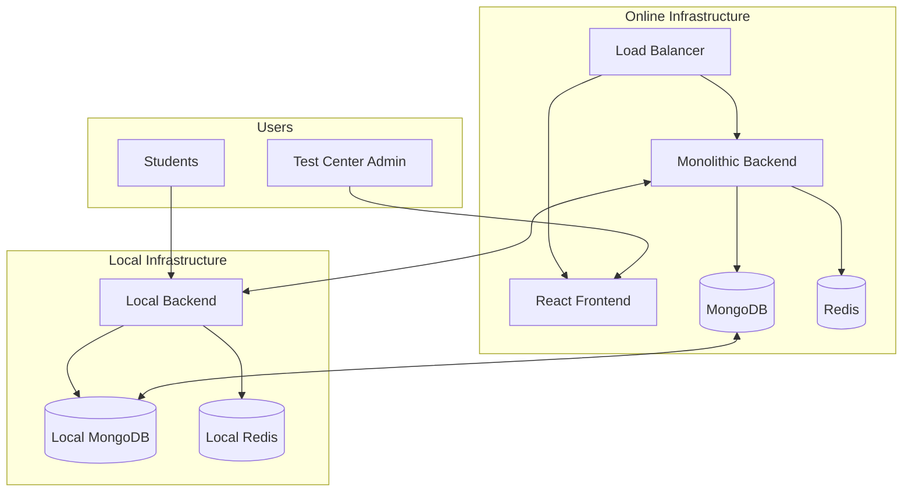

# CBT Application - Computer-Based Test Platform

A comprehensive testing platform built with the MERN stack that enables test center owners to create and manage tests while allowing students to take these tests in a controlled environment. The application features a monolithic architecture with hybrid online/local deployment capabilities.

## 🚀 Quick Start

### Prerequisites

- [Docker](https://docs.docker.com/get-docker/) and [Docker Compose](https://docs.docker.com/compose/install/)
- [Node.js](https://nodejs.org/) 18+ (for local development)
- [Git](https://git-scm.com/)
- At least 4GB RAM available

### Get Started in 3 Steps

1. **Clone and Setup**

   ```bash
   git clone <repository-url>
   cd cbt-application
   cp .env.example .env
   ```

2. **Start with Docker**

   ```bash
   chmod +x docker/dev-scripts.sh
   ./docker/dev-scripts.sh start
   ```

3. **Access the Application**
   - Frontend: http://localhost:3000
   - Backend API: http://localhost:4000
   - Local Server: http://localhost:5000

## 📋 Table of Contents

- [Features](#-features)
- [Architecture](#-architecture)
- [Technology Stack](#-technology-stack)
- [Project Structure](#-project-structure)
- [Development Setup](#-development-setup)
- [Docker Guide](#-docker-guide)
- [API Documentation](#-api-documentation)
- [Testing](#-testing)
- [Deployment](#-deployment)
- [Contributing](#-contributing)
- [License](#-license)

## ✨ Features

### Core Functionality

- **Test Center Management**: Register and manage test centers with role-based access
- **User Management**: Create test creators and register students
- **Rich Test Creation**: Support for multimedia questions (text, images, audio)
- **Question Bank**: Organize questions by subjects with reuse capabilities
- **Excel Import**: Bulk question import via Excel templates
- **Test Taking Interface**: Secure, timed test environment with calculator tool
- **Real-time Analytics**: Performance tracking and detailed reporting

### Advanced Features

- **Hybrid Architecture**: Online management with offline test delivery
- **Subscription Tiers**: Free and paid tiers with usage limits
- **Data Synchronization**: Seamless sync between online and local servers
- **Media Processing**: Automatic image and audio optimization
- **Security Features**: Anti-cheating measures and session monitoring
- **Multi-format Export**: PDF and CSV report generation

### Technical Features

- **Monolithic Architecture**: Single backend with modular internal structure
- **Docker Containerization**: Easy development and deployment
- **Responsive Design**: Mobile-friendly interface with Tailwind CSS
- **Real-time Updates**: WebSocket support for live test monitoring
- **Comprehensive Logging**: Structured logging with correlation IDs
- **Health Monitoring**: Built-in health checks and metrics

## 🏗️ Architecture

### High-Level Overview



### Monolithic Backend Structure

```
backend/
├── src/
│   ├── modules/
│   │   ├── auth/              # Authentication & authorization
│   │   ├── users/             # User & test center management
│   │   ├── tests/             # Test creation & management
│   │   ├── questions/         # Question bank & subjects
│   │   ├── subscriptions/     # Tier management & payments
│   │   ├── sync/              # Online/local synchronization
│   │   ├── analytics/         # Results & reporting
│   │   └── media/             # File processing & storage
│   ├── shared/
│   │   ├── middleware/        # Authentication, validation, etc.
│   │   ├── utils/             # Helper functions
│   │   ├── constants/         # Application constants
│   │   └── types/             # TypeScript definitions
│   ├── database/
│   │   ├── models/            # Mongoose schemas
│   │   ├── migrations/        # Database migrations
│   │   └── seeders/           # Test data seeders
│   └── index.js               # Application entry point
```

## 🛠️ Technology Stack

### Frontend

- **React 18+** - Modern UI library with hooks
- **Tailwind CSS** - Utility-first CSS framework
- **React Router** - Client-side routing
- **React Context** - State management
- **React Hook Form** - Form handling and validation
- **React Quill** - Rich text editor for questions

### Backend

- **Node.js** - JavaScript runtime
- **Express.js** - Web application framework
- **MongoDB** - NoSQL database with Mongoose ODM
- **Redis** - Caching and session storage
- **JWT** - Authentication tokens
- **Multer** - File upload handling
- **Sharp** - Image processing
- **FFmpeg** - Audio processing

### DevOps & Infrastructure

- **Docker & Docker Compose** - Containerization
- **NGINX** - Load balancer and reverse proxy
- **Prometheus & Grafana** - Monitoring (optional)
- **GitHub Actions** - CI/CD pipeline
- **MongoDB Atlas** - Cloud database (production)

### Development Tools

- **ESLint & Prettier** - Code formatting and linting
- **Jest** - Testing framework
- **Supertest** - API testing
- **Nodemon** - Development server with hot reload

## 📁 Project Structure

```
cbt-application/
├── frontend/                  # React application
│   ├── public/
│   ├── src/
│   │   ├── components/        # Reusable UI components
│   │   ├── pages/             # Page components
│   │   ├── contexts/          # React contexts
│   │   ├── services/          # API service functions
│   │   ├── hooks/             # Custom React hooks
│   │   ├── utils/             # Helper functions
│   │   └── styles/            # Global styles
│   ├── Dockerfile
│   └── package.json
├── backend/                   # Monolithic backend
│   ├── src/                   # Source code (see structure above)
│   ├── tests/                 # Test files
│   ├── Dockerfile
│   └── package.json
├── docker/                    # Docker configuration
│   ├── nginx/                 # NGINX configuration
│   ├── mongo-init/            # MongoDB initialization
│   ├── dev-scripts.sh         # Development scripts
│   └── README.md              # Docker documentation
├── .kiro/                     # Kiro IDE specifications
│   └── specs/
│       └── cbt-application/
│           ├── requirements.md
│           ├── design.md
│           └── tasks.md
├── docker-compose.yml         # Development environment
├── docker-compose.prod.yml    # Production environment
├── .env.example               # Environment template
├── .gitignore
├── DOCKER.md                  # Docker quick start guide
└── README.md                  # This file
```

## 💻 Development Setup

### Option 1: Docker Development (Recommended)

1. **Prerequisites**

   ```bash
   # Install Docker and Docker Compose
   # Windows: Docker Desktop
   # macOS: Docker Desktop
   # Linux: Follow official Docker installation guide
   ```

2. **Clone and Setup**

   ```bash
   git clone <repository-url>
   cd cbt-application
   cp .env.example .env
   # Edit .env with your configuration
   ```

3. **Start Development Environment**

   ```bash
   # Using convenience script
   chmod +x docker/dev-scripts.sh
   ./docker/dev-scripts.sh start

   # Or using docker-compose directly
   docker-compose up -d
   ```

4. **Development Commands**

   ```bash
   # View logs
   ./docker/dev-scripts.sh logs backend

   # Restart a service
   ./docker/dev-scripts.sh restart frontend

   # Stop all services
   ./docker/dev-scripts.sh stop

   # Clean up everything
   ./docker/dev-scripts.sh cleanup
   ```

### Option 2: Local Development

1. **Prerequisites**

   ```bash
   # Install Node.js 18+
   # Install MongoDB and Redis locally
   # Or use cloud services (MongoDB Atlas, Redis Cloud)
   ```

2. **Backend Setup**

   ```bash
   cd backend
   npm install
   cp ../.env.example .env
   # Configure database URLs in .env
   npm run dev
   ```

3. **Frontend Setup**
   ```bash
   cd frontend
   npm install
   npm start
   ```

## 🐳 Docker Guide

### Development Environment

```bash
# Start all services
docker-compose up -d

# View service status
docker-compose ps

# View logs
docker-compose logs -f backend

# Scale services
docker-compose up -d --scale backend=2

# Stop services
docker-compose down
```

### Production Deployment

```bash
# Build production images
docker-compose -f docker-compose.prod.yml build

# Start production environment
docker-compose -f docker-compose.prod.yml up -d

# Scale for high availability
docker-compose -f docker-compose.prod.yml up -d --scale backend=3
```

### Service Ports

| Service       | Development Port | Production Port | Description                  |
| ------------- | ---------------- | --------------- | ---------------------------- |
| Frontend      | 3000             | 80 (via NGINX)  | React application            |
| Backend       | 4000             | 4000            | Monolithic API server        |
| Local Server  | 5000             | 5000            | Offline test delivery        |
| MongoDB       | 27017            | 27017           | Main database                |
| Local MongoDB | 27018            | 27018           | Local database               |
| Redis         | 6379             | 6379            | Main cache                   |
| Local Redis   | 6380             | 6380            | Local cache                  |
| NGINX         | 80               | 80/443          | Load balancer + static files |

## 📖 API Documentation

### Authentication Endpoints

```bash
POST /api/auth/register     # Register test center
POST /api/auth/login        # User login
POST /api/auth/logout       # User logout
POST /api/auth/refresh      # Refresh JWT token
GET  /api/auth/me           # Get current user
```

### Test Management Endpoints

```bash
GET    /api/tests           # List tests
POST   /api/tests           # Create test
GET    /api/tests/:id       # Get test details
PUT    /api/tests/:id       # Update test
DELETE /api/tests/:id       # Delete test
POST   /api/tests/import    # Import from Excel
```

### Question Bank Endpoints

```bash
GET    /api/questions       # List questions
POST   /api/questions       # Create question
GET    /api/subjects        # List subjects
POST   /api/subjects        # Create subject
```

### Student & Test Session Endpoints

```bash
POST   /api/students        # Register student
GET    /api/sessions        # List test sessions
POST   /api/sessions/start  # Start test session
POST   /api/sessions/submit # Submit test answers
```

### Media Endpoints

```bash
POST   /api/media/upload    # Upload media files
GET    /api/media/:id       # Serve media files
```

For complete API documentation, visit http://localhost:4000/docs when running the application.

> **Note**: The application uses a single NGINX configuration that handles both static file serving and API proxying. See [docs/nginx-architecture.md](docs/nginx-architecture.md) for detailed information about the simplified architecture.

## 🧪 Testing

### Running Tests

```bash
# Backend tests
cd backend
npm test                    # Run all tests
npm run test:watch         # Watch mode
npm run test:coverage      # Coverage report

# Frontend tests
cd frontend
npm test                   # Run all tests
npm run test:coverage      # Coverage report

# Integration tests with Docker
docker-compose -f docker-compose.test.yml up --abort-on-container-exit
```

### Test Structure

```
backend/tests/
├── unit/                  # Unit tests
│   ├── auth/
│   ├── users/
│   └── tests/
├── integration/           # Integration tests
│   ├── api/
│   └── database/
└── e2e/                   # End-to-end tests
    ├── auth.test.js
    ├── test-creation.test.js
    └── test-taking.test.js
```

### Test Coverage Goals

- **Unit Tests**: >80% code coverage
- **Integration Tests**: All API endpoints
- **E2E Tests**: Critical user workflows

## 🚀 Deployment

### Production Checklist

- [ ] Update environment variables in `.env`
- [ ] Configure SSL certificates for NGINX
- [ ] Set up external managed databases (MongoDB Atlas, Redis Cloud)
- [ ] Configure monitoring and alerting
- [ ] Set up backup strategies
- [ ] Review security settings
- [ ] Configure CI/CD pipeline

### Environment Variables

```bash
# Application
NODE_ENV=production
PORT=4000

# Database
MONGODB_URL=mongodb://mongo:27017/cbt_app
REDIS_URL=redis://redis:6379

# Authentication
JWT_SECRET=your_jwt_secret_minimum_32_characters
JWT_REFRESH_SECRET=your_refresh_secret_minimum_32_characters

# Payment Processing
STRIPE_SECRET_KEY=sk_live_your_stripe_secret_key
PAYPAL_CLIENT_ID=your_paypal_client_id

# File Upload
MAX_FILE_SIZE=10485760
MAX_IMAGE_SIZE=5242880
MAX_AUDIO_SIZE=10485760

# Security
BCRYPT_ROUNDS=12
RATE_LIMIT_MAX_REQUESTS=100
CORS_ORIGIN=https://yourdomain.com
```

### Deployment Options

#### Option 1: Docker Compose (Simple)

```bash
# Production deployment
docker-compose -f docker-compose.prod.yml up -d
```

#### Option 2: Kubernetes (Scalable)

```bash
# Apply Kubernetes manifests
kubectl apply -f k8s/
```

#### Option 3: Cloud Platforms

- **AWS**: ECS, EKS, or Elastic Beanstalk
- **Google Cloud**: Cloud Run, GKE, or App Engine
- **Azure**: Container Instances, AKS, or App Service
- **DigitalOcean**: App Platform or Kubernetes

## 🔧 Configuration

### Feature Flags

```javascript
// Enable/disable features per test center
const features = {
  calculatorEnabled: true,
  aiProctoringEnabled: false,
  adaptiveTestingEnabled: false,
  blockchainCertificatesEnabled: false,
};
```

### Subscription Tiers

| Feature           | Free Tier | Paid Tier |
| ----------------- | --------- | --------- |
| Tests per month   | 5         | Unlimited |
| Students per test | 50        | Unlimited |
| Media storage     | 100MB     | 10GB      |
| Analytics         | Basic     | Advanced  |
| Support           | Community | Priority  |

## 🤝 Contributing

### Development Workflow

1. **Fork the repository**
2. **Create a feature branch**
   ```bash
   git checkout -b feature/your-feature-name
   ```
3. **Make your changes**
4. **Write tests**
5. **Run the test suite**
   ```bash
   npm test
   ```
6. **Commit your changes**
   ```bash
   git commit -m "Add your feature description"
   ```
7. **Push to your fork**
   ```bash
   git push origin feature/your-feature-name
   ```
8. **Create a Pull Request**

### Code Standards

- **ESLint**: Follow the configured linting rules
- **Prettier**: Use for code formatting
- **Conventional Commits**: Use conventional commit messages
- **Test Coverage**: Maintain >80% coverage for new code

### Commit Message Format

```
type(scope): description

feat(auth): add OAuth integration
fix(tests): resolve question import bug
docs(readme): update installation guide
```

## 🐛 Troubleshooting

### Common Issues

#### Port Already in Use

```bash
# Find process using port
lsof -i :3000
# Kill the process
kill -9 <PID>
```

#### Docker Permission Issues

```bash
# Add user to docker group
sudo usermod -aG docker $USER
newgrp docker
```

#### Database Connection Issues

```bash
# Reset databases
./docker/dev-scripts.sh reset-db

# Check database logs
docker-compose logs mongo
```

#### Memory Issues

```bash
# Check Docker resource usage
docker stats

# Increase Docker memory limit in Docker Desktop settings
```

### Getting Help

1. **Check the logs**: `docker-compose logs <service>`
2. **Verify service health**: `curl http://localhost:4000/health`
3. **Review environment variables**: Check `.env` file
4. **Reset everything**: `./docker/dev-scripts.sh cleanup && ./docker/dev-scripts.sh start`
5. **Check documentation**: [docker/README.md](docker/README.md)

## 📊 Monitoring

### Health Checks

```bash
# Backend health
curl http://localhost:4000/health

# Frontend health
curl http://localhost:3000/health

# Database health
docker-compose exec mongo mongosh --eval "db.adminCommand('ping')"
```

### Metrics

- **Application Metrics**: Response times, error rates, throughput
- **Business Metrics**: Test completions, user registrations, subscription conversions
- **Infrastructure Metrics**: CPU, memory, disk usage, network I/O

## 🔒 Security

### Security Features

- **Authentication**: JWT with refresh tokens
- **Authorization**: Role-based access control
- **Input Validation**: Comprehensive request validation
- **Rate Limiting**: API endpoint protection
- **CORS**: Cross-origin request security
- **Helmet**: Security headers
- **Data Encryption**: Passwords hashed with bcrypt

### Security Best Practices

- Regular dependency updates
- Environment variable protection
- Database query parameterization
- File upload restrictions
- Session management
- Audit logging

## 📄 License

This project is licensed under the MIT License - see the [LICENSE](LICENSE) file for details.

## 🙏 Acknowledgments

- **MERN Stack Community** - For the excellent documentation and tools
- **Docker Community** - For containerization best practices
- **Open Source Contributors** - For the amazing libraries and frameworks used

## 📞 Support

- **Documentation**: Check the [docs](docs/) directory
- **Issues**: Create an issue on GitHub
- **Discussions**: Use GitHub Discussions for questions
- **Email**: support@cbt-application.com

---

**Built with ❤️ using the MERN stack and modern DevOps practices**

For more detailed information, check out:

- [Docker Setup Guide](DOCKER.md)
- [API Documentation](docs/api.md)
- [Deployment Guide](docs/deployment.md)
- [Contributing Guidelines](CONTRIBUTING.md)
