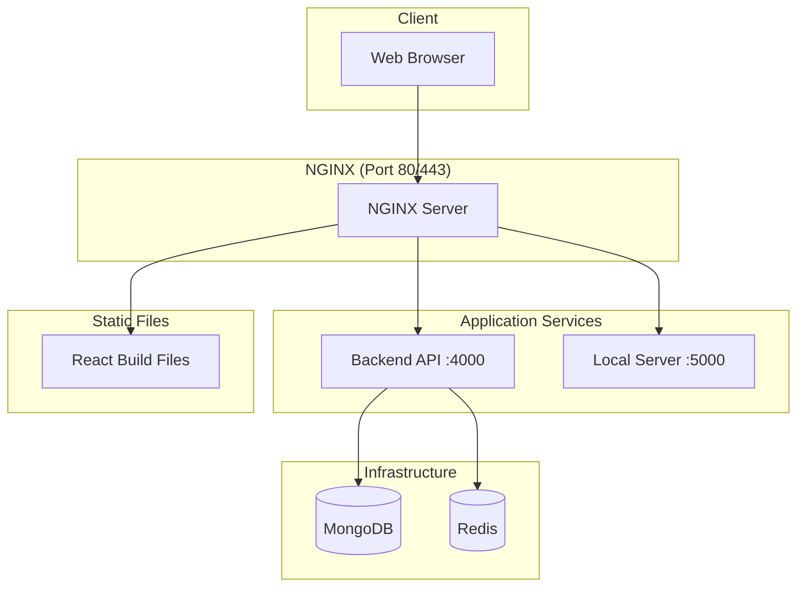

# NGINX Architecture - Simplified Single Configuration

## Overview

The CBT application now uses a **single, consolidated NGINX configuration** instead of multiple nginx instances. This simplifies deployment, reduces confusion, and improves maintainability.

## Previous Problem

❌ **Before**: We had two separate nginx configurations:

- `docker/nginx/nginx.conf` - Load balancer and reverse proxy
- `frontend/docker/nginx.conf` - Static file server for React

This caused:

- Configuration duplication and conflicts
- Multiple nginx instances running
- Unclear routing and deployment strategy
- Maintenance overhead

## Current Solution

✅ **Now**: Single nginx configuration that handles:

- **Static file serving** for React frontend
- **Reverse proxy** for backend API
- **Load balancing** for multiple backend instances
- **Rate limiting** and security headers
- **SSL termination** (production)

## Architecture



## Routing Rules

| Request Path   | Destination        | Purpose         |
| -------------- | ------------------ | --------------- |
| `/`            | Static files       | React SPA       |
| `/static/*`    | Static files       | CSS, JS, images |
| `/api/*`       | Backend :4000      | API endpoints   |
| `/local-api/*` | Local Server :5000 | Offline API     |
| `/media/*`     | Backend :4000      | Media files     |
| `/health`      | NGINX              | Health check    |

## Configuration Details

### Development Mode

```yaml
# docker-compose.yml
services:
  frontend:
    # Runs React dev server on :3000
    # Direct access for hot reload

  backend:
    # API server on :4000

  nginx:
    # Optional load balancer
    # Use profile: loadbalancer
```

### Production Mode

```yaml
# docker-compose.prod.yml
services:
  frontend-builder:
    # Builds React app
    # Outputs to shared volume

  nginx:
    # Serves static files from volume
    # Proxies API requests to backend

  backend:
    # API server (can be scaled)
```

## Benefits

### 🎯 **Simplified Architecture**

- Single nginx configuration to maintain
- Clear separation of concerns
- No configuration duplication

### 🚀 **Better Performance**

- Direct static file serving (no proxy overhead)
- Efficient caching strategies
- Optimized for production

### 🔧 **Easier Deployment**

- Single nginx container in production
- Simplified scaling (backend only)
- Clear routing rules

### 🛡️ **Enhanced Security**

- Centralized security headers
- Consistent rate limiting
- Single SSL termination point

## Usage

### Development

```bash
# Start without load balancer (direct access)
docker-compose up -d

# Access:
# Frontend: http://localhost:3000 (dev server)
# Backend: http://localhost:4000 (API)

# Start with load balancer (production-like)
docker-compose --profile loadbalancer up -d

# Access:
# Everything: http://localhost (nginx)
```

### Production

```bash
# Deploy production stack
docker-compose -f docker-compose.prod.yml up -d

# Access:
# Everything: http://localhost (nginx serves static + proxies API)
```

## File Structure

```
project/
├── docker/
│   └── nginx/
│       └── nginx.conf          # Single nginx configuration
├── frontend/
│   └── Dockerfile              # Builds React app only
└── docker-compose.yml          # Uses nginx optionally
```

## Migration Notes

### What Changed

- ✅ Removed `frontend/docker/nginx.conf`
- ✅ Updated `docker/nginx/nginx.conf` to serve static files
- ✅ Modified production deployment to use shared volumes
- ✅ Simplified frontend Dockerfile

### What Stayed the Same

- ✅ All API endpoints work identically
- ✅ Development workflow unchanged
- ✅ Security and performance features maintained

## Troubleshooting

### Common Issues

**Static files not loading:**

```bash
# Check nginx volume mount
docker-compose logs nginx

# Verify build files exist
docker-compose exec nginx ls -la /usr/share/nginx/html
```

**API requests failing:**

```bash
# Check backend connectivity
docker-compose exec nginx curl http://backend:4000/health

# Check nginx configuration
docker-compose exec nginx nginx -t
```

**Development vs Production confusion:**

- **Development**: Access frontend directly at :3000
- **Production**: Access everything through nginx at :80

This simplified architecture provides a cleaner, more maintainable solution while preserving all functionality.
